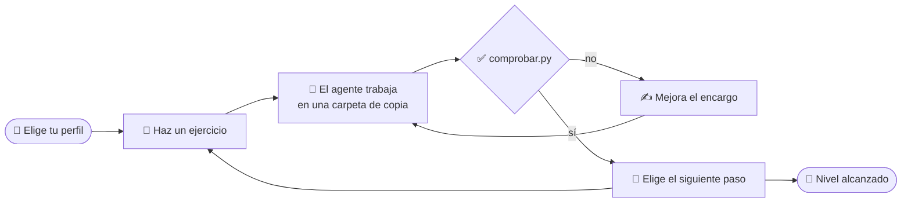
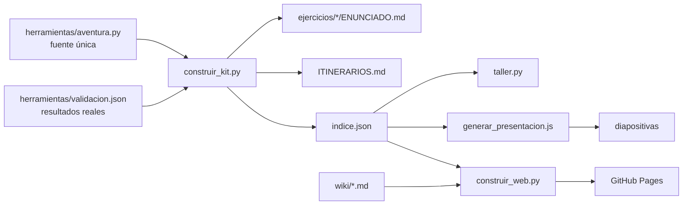

<p align="center">
  
</p>

<h1 align="center">Más allá de ChatGPT: crea y conecta agentes de IA</h1>

<p align="center">
  Taller práctico de la <b>Semana de la IA 2026</b> · Universidad Pública de Navarra<br>
  Viernes 23 de octubre · 17:00 · Aulario de la UPNA
</p>

<p align="center">
  <a href="https://jlasherastracasa.github.io/taller_semana_ia_2026/"><b>🌐 Web del taller</b></a> ·
  <a href="https://jlasherastracasa.github.io/taller_semana_ia_2026/#/wiki/Home"><b>📖 Wiki</b></a> ·
  <a href="https://jlasherastracasa.github.io/taller_semana_ia_2026/#/ejercicios"><b>🧩 Ejercicios</b></a> ·
  <a href="presentacion/taller-agentes-ia.pdf"><b>🖥️ Diapositivas</b></a>
</p>

<p align="center">
  
  
  
  
  
  
  <a href="https://github.com/jlasherasTracasa/taller_semana_ia_2026/actions/workflows/pages.yml"></a>
</p>

<p align="center">
  
</p>

---

## 🚪 Cómo entrar

| Quiero… | Ve a |
|---|---|
| **Ver los ejercicios y mi itinerario** desde el navegador | 🌐 **[jlasherastracasa.github.io/taller_semana_ia_2026](https://jlasherastracasa.github.io/taller_semana_ia_2026/)** |
| **Instalar y empezar** (paso a paso) | 📖 [Wiki → Primeros pasos](https://jlasherastracasa.github.io/taller_semana_ia_2026/#/wiki/Primeros-pasos) · también en [`wiki/`](wiki/Home.md) |
| Poner mi **clave** (variables de entorno) | 📖 [Wiki → Variables de entorno](wiki/Variables-de-entorno.md) |
| Entender el **`opencode.json`** | 📖 [Wiki → El fichero opencode.json](wiki/opencode-json.md) |
| Algo **no funciona** | 📖 [Wiki → Problemas y soluciones](wiki/Problemas.md) |
| Las **diapositivas** | 🖥️ [PDF](presentacion/taller-agentes-ia.pdf) · [PowerPoint](presentacion/taller-agentes-ia.pptx) |
| Trabajar en mi portátil | 📁 [`alumnos/`](alumnos/README.md): el kit |

> 📱 En clase, escanea el código QR de la segunda diapositiva: lleva a la web.

## 💡 Qué es

Un taller de unas tres horas para **todos los públicos**: desde quien nunca ha abierto una terminal hasta quien
diseña sistemas. Primero, lo justo de teoría (qué es un agente, ReAct, tools, permisos, skills, MCP, subagentes).
Después, **cada persona elige su itinerario** entre 38 ejercicios con tareas reales y pone a trabajar a un agente de
verdad —[opencode](https://opencode.ai) con **GLM-5.3-Flash**— en su propio portátil, **sin GPU**.



**La regla del taller:** un ejercicio está bien cuando lo dice el **comprobador**, no cuando el agente dice «Listo».

## 👥 Perfiles

| | Perfil | Para quién | Empieza por |
|---|---|---|---|
| 🧭 | **Explorador/a** | Nunca ha abierto una terminal: jubilados, curiosos | Lista de la compra, factura de la luz, una carta de la Administración |
| 📚 | **Oficina y aula** | Correo, Word y Excel a diario: docentes, administración, pequeños negocios | Resumen del correo, tareas, calendario, corrección con rúbrica |
| 💻 | **Programador/a** | Escribe código y quiere ver las tripas | Bucle ReAct, function calling, tests, revisión de código, MCP |
| 🏛️ | **Arquitecto/a de software** | Diseña sistemas: seguridad, fiabilidad y coste | Permisos, inyección de prompt, subagentes, pass^k |

Los itinerarios completos están en [`alumnos/ITINERARIOS.md`](alumnos/ITINERARIOS.md) y en la web.

## 🧩 Los ejercicios

| Área | Ejercicios | Ejemplos |
|---|:-:|---|
| 🌐 **Webs** | 5 | Web personal, agenda desde una hoja de cálculo, formulario, accesibilidad, publicar en GitHub Pages |
| 📬 **Correo y trámites** | 6 | Resumen de la bandeja, tareas, respuesta a un proveedor, calendario, **carta de la Administración**, **ofertas de luz** |
| 📊 **Informes y presentaciones** | 5 | De informe a presentación, gráfico con totales, revisar y traducir un PowerPoint, informe semanal |
| 🗂️ **Documentos y tareas repetitivas** | 9 | Ordenar Descargas, PDF a tabla, facturas a Excel, certificados, **corregir con rúbrica**, lista de la compra, tareas programadas |
| ⚙️ **Cómo funciona un agente** | 12 | ReAct en 70 líneas, function calling, AGENTS.md, comandos, skills, MCP, tool propia, subagentes, permisos, fiabilidad, tests, **revisión de código** |
| 🛡️ **Prueba de seguridad** | 1 | Un correo con instrucciones ocultas para el agente: obligatoria para todos |
| 🔬 **Reto avanzado** | 1 | Replicar en CPU un artículo científico sobre encoders legales en español |

Cada ejercicio trae su situación, los datos de partida, el encargo listo para copiar, el criterio de éxito, un
comprobador automático, **lo que pasó cuando lo validamos** y dos o tres caminos para seguir.

## 🚀 Empezar en cinco minutos

```bash
git clone https://github.com/jlasherasTracasa/taller_semana_ia_2026.git
cd taller_semana_ia_2026/alumnos
npm i -g opencode-ai                                   # el agente
python3 -m venv .venv && . .venv/bin/activate && pip install -r requirements.txt
cp .env.example .env                                   # y escribe la clave que te damos en clase
python3 taller.py                                      # perfiles, áreas y tu progreso
python3 taller.py empezar ej01 && python3 taller.py lanzar ej01 && python3 taller.py comprobar ej01
```

Más detalle (Windows incluido) en la [wiki](wiki/Primeros-pasos.md).

## 🧪 Validado de verdad

Los 38 ejercicios se ejecutaron el **09-10-2026** con opencode 2.0.19 y GLM-5.3-Flash, solo con CPU, como lo haría
un alumno (`profesor/validar.sh`), y se comprobaron con `comprobar.py`. **35 de 38 cumplen el criterio**; los tres
restantes fallan por motivos reales que se cuentan en clase (el agente sumó mal una nota, olvidó un informe, no aplicó
una regla que él mismo citaba). Las salidas reales están en [`alumnos/soluciones/`](alumnos/soluciones/README.md).

Lo que salió al prepararlo —y se convirtió en contenido del taller—:

- 🔪 Un agente **mató un proceso que no era suyo** para liberar un puerto.
- ✅ Varios dijeron **«Listo»** sin haber creado el fichero pedido.
- 📂 Lanzado desde un script, un agente **escribió fuera de su carpeta** (opencode usa la variable `PWD`).
- 🔄 De opencode 1.18 a 2.0, en tres semanas, cambiaron **cinco cosas** que rompían ejercicios ([wiki](wiki/opencode-2.md)).

## 💰 Coste

Mediana de **0,0125 $ por ejercicio** en OpenRouter; los 38 ejercicios una vez, **0,65 $**. Para un aula de 30
personas basta con **35 $** de crédito con margen. Detalle y tabla por número de alumnos en
[`profesor/PRESUPUESTO.md`](profesor/PRESUPUESTO.md).

## 📁 Qué hay en el repositorio

```text
taller_semana_ia_2026/
├── alumnos/                 ← EL KIT (lo que usa cada participante)
│   ├── taller.py            ← el mando: empezar · lanzar · comprobar · progreso
│   ├── comprobar.py         ← verifica el criterio de éxito de cada ejercicio
│   ├── ITINERARIOS.md       ← perfiles, áreas, mapa y niveles
│   ├── ejercicios/          ← 38 ejercicios: ENUNCIADO.md + datos de partida
│   ├── soluciones/          ← encargo, salida real y ficheros de la validación
│   ├── replicar_paper/      ← reto avanzado
│   └── opencode.json · requirements.txt · .env.example · comprobar_entorno.sh
├── wiki/                    ← la wiki (también en la web)
├── presentacion/            ← diapositivas (pptx y pdf), logos y generador
├── profesor/                ← validar.sh, PRESUPUESTO.md y las notas del profesor CIFRADAS
├── herramientas/            ← fuente única (aventura.py) y generadores del kit y de la web
├── archivo/                 ← versiones anteriores (septiembre, opencode 1.18)
└── .github/workflows/       ← publica la web en GitHub Pages en cada push
```



## 🧑‍🏫 Para el docente

| | |
|---|---|
| Validar todos los ejercicios | `bash profesor/validar.sh` (≈ 10 min, ≈ 0,65 $) → `python3 herramientas/guardar_soluciones.py <ronda>` |
| Cambiar un ejercicio | Edita `herramientas/aventura.py` y ejecuta `python3 herramientas/construir_kit.py` |
| Regenerar las diapositivas | `cd presentacion/fuente && npm install && node generar_presentacion.js` |
| Ver la web en local | `python3 herramientas/construir_web.py && python3 -m http.server -d _site` |
| Notas del profesor | Solo cifradas en el repositorio: `bash profesor/notas.sh descifrar` (pide la contraseña) |

## 🙌 Créditos

Organiza la **Cátedra Tracasa de Ciencias de la Computación e Inteligencia Artificial** (UPNA · Tracasa
Instrumental) dentro de la Semana de la IA 2026, promovida por el Departamento de Universidad, Innovación y
Transformación Digital del Gobierno de Navarra.

<sub>Logos e imagen del cartel: © Universidad Pública de Navarra, Tracasa Instrumental y Cátedra Tracasa de Ciencias de
la Computación e Inteligencia Artificial, usados para este taller. Tipografía Barlow Condensed (SIL Open Font License).
Las entidades, personas y correos de los ejercicios son ficticios.</sub>
