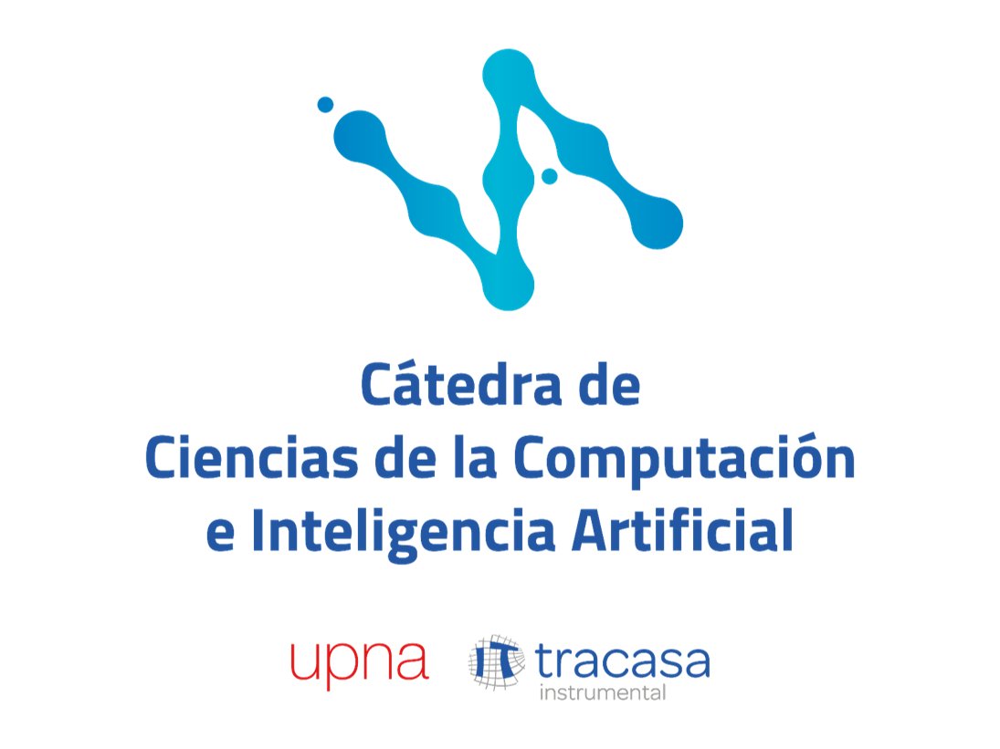

<p align="center">
  
</p>

<h1 align="center">:robot: Taller «Agentes de IA para el trabajo de cada día»</h1>

<p align="center">
  <em>Semana de la IA 2026 · Universidad Pública de Navarra · 23 de octubre de 2026</em><br>
  <em>Guía del docente: qué hay, cómo prepararlo, cómo darlo y cómo regenerarlo todo.</em>
</p>

<p align="center">
  
  
  
  
  
</p>

<p align="center">
  <br>
  <sub>Portada: «El primer golpe», generada con Qwen-Image-2.1 en el proyecto de este repositorio (no se presenta al concurso).</sub>
</p>

---

## :dart: En 30 segundos

- **Qué es:** un taller práctico de unas 3 horas para público no especialista. Primero se explica qué es un
  agente (ReAct, tools, permisos, skills, MCP, subagentes) y después se ponen a trabajar agentes reales con
  **opencode + GLM-5.3-Flash** en tareas de oficina: webs, correo, presentaciones y rutinas.
- **Qué necesitan los alumnos:** un portátil **sin GPU**, Node 18+, Python 3.10+ y la URL y clave de LiteLLM que
  les das tú.
- **Qué les das:** `entrega/taller_alumnos.zip` (se genera con `bash scripts/zip_alumnos.sh`), con la
  presentación, la guía, los 26 ejercicios con datos y soluciones reales y la réplica de un paper.
- **Qué está comprobado:** los 26 ejercicios se ejecutaron de verdad el 28-09-2026 con el kit tal cual (mismo
  `opencode.json`, solo CPU). Los problemas que salieron están documentados abajo y se cuentan en clase.

## :file_folder: Qué hay en esta carpeta

```text
docs/taller/
├── README.md                  ← esta guía del docente
├── presentacion/
│   ├── taller-agentes-ia.pptx ← la presentación (32 diapositivas con notas del ponente)
│   ├── taller-agentes-ia.pdf  ← la misma en PDF, por si falla PowerPoint
│   ├── assets/                ← logos oficiales (Cátedra, UPNA, Tracasa) e imagen de portada
│   └── fuente/                ← generador pptxgenjs + datos de los ejercicios (README propio)
├── alumnos/                   ← EL KIT: lo que va en el zip (README propio)
│   ├── README.md, guia_alumno.md, opencode.json, .env.example, comprobar_entorno.sh
│   ├── ejercicios/            ← 26 enunciados con sus datos de partida (sin solución)
│   ├── soluciones/            ← prompt exacto, salida real y ficheros generados de cada uno
│   └── replicar_paper/        ← reto avanzado: réplica en CPU de un paper de encoders legales
├── profesor/                  ← material del docente (README propio)
│   ├── validar_ejercicio.sh   ← ejecuta un ejercicio como un alumno y guarda la salida real
│   └── ejemplos/              ← banco de ejemplos validados + verificar_todo.sh (18 comprobaciones)
└── archivo/                   ← versiones anteriores (pptx v1 y v2, guía v2, revisiones)
```

## :white_check_mark: Antes del taller

**Una semana antes**

- [ ] Crea en LiteLLM una clave por alumno (o una compartida con límite de gasto) y apunta la URL base.
      Coste orientativo con GLM-5.3-Flash: céntimos por alumno y taller.
- [ ] Genera y prueba el zip: `bash scripts/zip_alumnos.sh`, descomprímelo en una carpeta limpia y ejecuta
      `bash comprobar_entorno.sh` con tu `.env`.
- [ ] Envía el zip con estas instrucciones: instalar Node 18+ y `npm i -g opencode-ai`, y traer el portátil cargado.
- [ ] Si vas a hacer el reto del paper en clase, avisa de que descarga unos 1,6 GB de modelos la primera vez.

**El día del taller**

- [ ] Comprueba que la URL de LiteLLM es accesible desde la red del aula (`curl $LITELLM_API_BASE/health`).
- [ ] Lleva `taller-agentes-ia.pdf` en un USB, por si acaso.
- [ ] Prepara en tu portátil las demos en directo: `alumnos/ejercicios/f0_react_bucle/` y
      `alumnos/ejercicios/ej10_inyeccion_prompt/`.
- [ ] Reparte las claves en papel o en una diapositiva privada, **nunca** dentro del zip ni en el repositorio.

## :clock3: Agenda (≈ 3 h)

| Bloque | Min | Diapositivas | Qué hacer en el aula |
|---|---:|---|---|
| 0 · Conceptos | 30 | 4–15 | Agente, anatomía, **ReAct**, tools, permisos, MCP, skills, subagentes. **Demo en directo: F.0** (`react_min.py`) |
| A · Web | 30 | 17 | EJ 01 y EJ 02 todos; EJ 03–05 los rápidos |
| B · Correo | 30 | 18–19 | EJ 06–08 y **EJ 10 (inyección)** todos juntos |
| C · Presentaciones | 20 | 20 | EJ 11 y EJ 12 |
| D · Rutinas | 25 | 21 | EJ 15 y EJ 16; EJ 21 (timer) en directo por el docente, en modo interactivo |
| E · Seguridad | 15 | 24–28 | Los **tres casos reales** de abajo + cuándo NO usar un agente |
| F · Tools y skills | 20 | 22–23 | F.1 (function calling), F.2 (comando) y F.3 (MCP) |
| Cierre | 10 | 29–32 | Reto del paper, glosario y «qué hacer el lunes» |

Si hay poco tiempo, quita C y D: los conceptos, el EJ 10 y los casos reales son lo que más se recuerda.

## :rotating_light: Tres casos reales para contar en clase

Salieron al validar el kit y son lo más didáctico del taller: cada uno tiene diapositiva o está en las soluciones.

1. **El agente mató un proceso ajeno (EJ 03).** Con `bash` en `allow`, el 8000 ocupado y el encargo «arranca el
   servidor», el agente mató el proceso de otro programa para liberar el puerto (`salida_incidente.txt`).
   → Por eso el kit deniega `kill`, `pkill`, `killall`, `rm -rf` y `sudo` por patrón (verificado en el log de
   opencode: `pattern="kill 600198" action=deny`).
2. **Al prohibir `kill`, no podía parar ni su propio servidor (EJ 03, segundo intento).** Se inventó un endpoint
   `/shutdown`, dejó un servidor vivo y dio un PID que **no existía** (`salida_sin_kill.txt`).
   → El patrón correcto es arrancar con `timeout 60 …`; ahora va en el prompt.
3. **«Listo.» y no lo estaba (EJ 20).** Un MCP de Notion de la configuración global del docente añadía 30 tools; el
   modelo llamó a una que no existía, escribió un script de 4 líneas que no hacía nada y dijo «Listo». Sin esas
   tools, el mismo prompt salió bien en 10 s.
   → Más tools no es mejor, y «he terminado» no es una prueba.

Otros detalles del mismo tipo, citados en las soluciones: F.0 cuenta mal las líneas de un fichero que acaba de
leer; en el EJ 13 el resumen del agente contradice su propio informe; en el EJ 04 respondió en inglés hasta que el
prompt pidió castellano.

## :wrench: Cómo se regenera todo

Desde la raíz del repositorio y con el `.env` cargado (`set -a; . ./.env; set +a`):

| Qué | Orden |
|---|---|
| Datos de las tarjetas de ejercicios | `python3 docs/taller/presentacion/fuente/extraer_ejercicios.py` |
| Presentación (pptx) | `cd docs/taller/presentacion/fuente && npm install && node generar_presentacion.js` |
| PDF de la presentación | `soffice --headless --convert-to pdf taller-agentes-ia.pptx` (LibreOffice) |
| Validar un ejercicio como un alumno | `bash docs/taller/profesor/validar_ejercicio.sh ej03_formulario_json` |
| Comprobaciones objetivas del banco (sin LLM) | `bash docs/taller/profesor/ejemplos/verificar_todo.sh` |
| Réplica del paper completa (≈ 6 min en CPU) | `bash docs/taller/alumnos/replicar_paper/verificar.sh --reranker` |
| Zip para los alumnos | `bash scripts/zip_alumnos.sh` → `entrega/taller_alumnos.zip` |

`validar_ejercicio.sh` copia el ejercicio a `/tmp/curso_agentes/validacion/`, usa el `opencode.json` del kit,
**aísla tu configuración global de opencode** (MCP, ajustes) para que el agente vea lo mismo que un alumno, ejecuta
el prompt del enunciado y guarda `prompt.txt` y `salida.txt` en `alumnos/soluciones/<ejercicio>/`. Revisa siempre a
mano el resultado antes de darlo por bueno: el caso 3 pasó con código de salida 0.

## :warning: Límites conocidos

- Las respuestas cambian entre ejecuciones; lo que tiene que coincidir es el criterio de éxito, no el texto.
- `opencode run` no puede contestar a un permiso `ask`: la tool se queda bloqueada. Por eso el kit usa `allow`
  con patrones `deny`, y el EJ 21 (que usa `systemctl`, en `ask`) se hace en modo interactivo.
- En la máquina de validación no había `cron`; el EJ 21 se validó con un timer de systemd de usuario.
- El EJ 04 no publica nada: el `git push` y la URL pública son del alumno, con su cuenta y un token de permisos
  mínimos.
- EJ 13, EJ 14 y F.2 aprovecharon una skill `pptx` instalada en la máquina del docente; sin ella el agente valida
  de otra forma (python-pptx, LibreOffice). Las soluciones lo explican.
- Los totales solo salen exactos si el prompt pide «calculados, no inventados»; aun así, hay que comprobarlos.

## :question: Preguntas frecuentes

<details>
<summary><b>¿Puedo usar otro modelo u otro proveedor?</b></summary>

Sí. Cambia `provider` en `opencode.json` (por ejemplo, OpenRouter con `{env:OPENROUTER_API_KEY}`) y el nombre del
modelo en los prompts. Los ejercicios no dependen de GLM, pero las salidas de referencia sí.
</details>

<details>
<summary><b>¿Y si un alumno no puede instalar Node?</b></summary>

Que haga los ejercicios F.0 y F.1, que solo necesitan Python y `pip install litellm`, y siga el resto en pareja.
</details>

<details>
<summary><b>¿Es seguro dejar <code>bash</code> en <code>allow</code>?</b></summary>

Solo en una carpeta desechable y con los patrones `deny` del kit, que es lo que se hace. Antes de usarlo con
ficheros reales, cambia a `ask` y trabaja en modo interactivo.
</details>

<details>
<summary><b>¿Dónde está el material de la versión anterior?</b></summary>

En `archivo/`: presentaciones v1 (original) y v2, la guía v2, la estructura original y las revisiones.
</details>

---

<sub>Logos: © Universidad Pública de Navarra, Tracasa Instrumental y Cátedra de Ciencias de la Computación e
Inteligencia Artificial, descargados de sus webs oficiales para uso en el taller. Presentación, guía y ejercicios
preparados con la ayuda de Claude y GLM-5.3-Flash, y revisados a mano.</sub>
