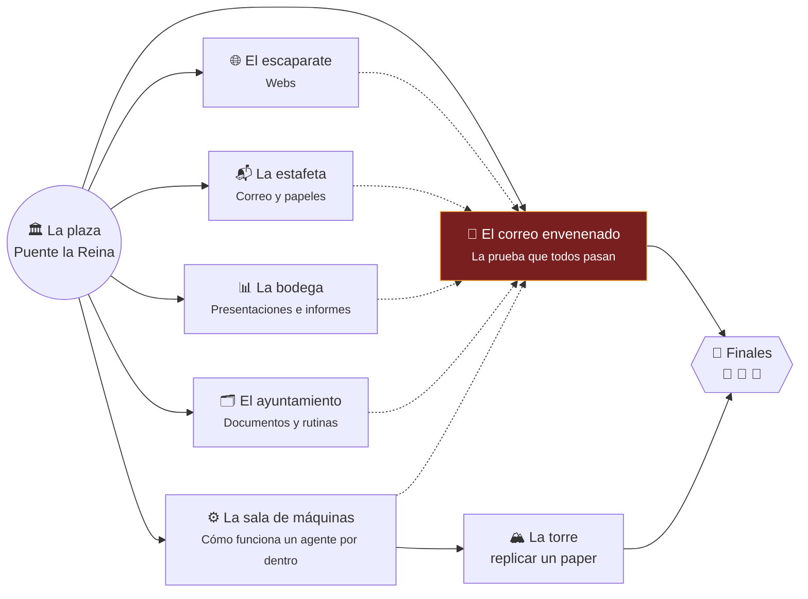

# 🧭 Elige tu propia aventura · Agentes de IA en Puente la Reina

> Taller «Más allá de ChatGPT: crea y conecta agentes de IA» · Semana de la IA 2026 · UPNA · viernes 23 de octubre

*Viernes, 23 de octubre de 2026. Puente la Reina / Gares, a 24 km de Pamplona.*

Pilar Azcona, cuarenta años al frente de la panadería de la calle Mayor y ahora jubilada, te espera en la plaza
con un portátil sin tarjeta gráfica y un papel con una clave.

—Me han dicho que sabes de esos **agentes de IA** —te dice—. No quiero un chat que me dé conversación: quiero uno
que **haga** cosas. El pueblo está lleno de recados atrasados. ¿Me ayudas?

Delante de ti hay cinco puertas y, al fondo, una sexta que nadie quiere abrir. Cada puerta es un tipo de trabajo.
Cada ejercicio es una escena. Al final de cada escena **tú eliges** adónde ir.

**La única regla del juego:** un sello 🏅 solo vale si lo da `comprobar.py`, nunca si lo dice el agente.


## 🗺️ El mapa



## 🧑‍🤝‍🧑 ¿Quién eres?

Elige el perfil que más se parezca a ti. Es solo una ruta recomendada: puedes cambiar de puerta cuando quieras.

### 🧭 Explorador/a

*Nunca he abierto una terminal. Jubilados, curiosos, gente que quiere entender qué es esto.*

**Ruta:** [F.0](ejercicios/f0_react_bucle/ENUNCIADO.md) → [EJ 24](ejercicios/ej24_lista_compra/ENUNCIADO.md) → [EJ 01](ejercicios/ej01_pagina_personal/ENUNCIADO.md) → [EJ 25](ejercicios/ej25_carta_explicada/ENUNCIADO.md) → [EJ 06](ejercicios/ej06_resumen_diario/ENUNCIADO.md) → [EJ 10](ejercicios/ej10_inyeccion_prompt/ENUNCIADO.md) → [EJ 15](ejercicios/ej15_ordenar_descargas/ENUNCIADO.md) → [EJ 19](ejercicios/ej19_certificados_pdf/ENUNCIADO.md)

💡 Trabaja en pareja. Usa el modo interactivo (`opencode`) y lee en voz alta lo que hace el agente.

### 📚 Oficina y aula

*Uso a diario el correo, Word y Excel. Docentes, administración, pequeños negocios.*

**Ruta:** [EJ 06](ejercicios/ej06_resumen_diario/ENUNCIADO.md) → [EJ 07](ejercicios/ej07_tareas_csv/ENUNCIADO.md) → [EJ 09](ejercicios/ej09_calendario_ics/ENUNCIADO.md) → [EJ 10](ejercicios/ej10_inyeccion_prompt/ENUNCIADO.md) → [EJ 23](ejercicios/ej23_corregir_rubrica/ENUNCIADO.md) → [EJ 12](ejercicios/ej12_grafico_pptx/ENUNCIADO.md) → [EJ 18](ejercicios/ej18_facturas_excel/ENUNCIADO.md) → [F.2](ejercicios/f2_agents_md/ENUNCIADO.md) → [F.4](ejercicios/f4_skills/ENUNCIADO.md)

💡 Fíjate en el CRITERIO de cada encargo: es lo que convierte un «parece bien» en un «está bien».

### 💻 Programador/a

*Escribo código. Quiero ver las tripas: tools, MCP, comandos, skills, subagentes.*

**Ruta:** [F.0](ejercicios/f0_react_bucle/ENUNCIADO.md) → [F.1](ejercicios/f1_function_calling/ENUNCIADO.md) → [F.10](ejercicios/f10_tests_primero/ENUNCIADO.md) → [EJ 03](ejercicios/ej03_formulario_json/ENUNCIADO.md) → [F.3](ejercicios/f3_comandos/ENUNCIADO.md) → [F.4](ejercicios/f4_skills/ENUNCIADO.md) → [F.5](ejercicios/f5_mcp/ENUNCIADO.md) → [F.6](ejercicios/f6_tool_propia/ENUNCIADO.md) → [F.7](ejercicios/f7_subagentes/ENUNCIADO.md) → [EJ 20](ejercicios/ej20_vigilar_web/ENUNCIADO.md) → [EJ 21](ejercicios/ej21_programar_cron/ENUNCIADO.md)

💡 Lee la traza de herramientas (`opencode run --format json`) y compárala con lo que el agente dice.

### 🏛️ Arquitecto/a de software

*Diseño sistemas. Me preocupan la seguridad, la fiabilidad, el coste y dónde poner los límites.*

**Ruta:** [F.0](ejercicios/f0_react_bucle/ENUNCIADO.md) → [F.1](ejercicios/f1_function_calling/ENUNCIADO.md) → [F.8](ejercicios/f8_permisos/ENUNCIADO.md) → [EJ 10](ejercicios/ej10_inyeccion_prompt/ENUNCIADO.md) → [F.5](ejercicios/f5_mcp/ENUNCIADO.md) → [F.6](ejercicios/f6_tool_propia/ENUNCIADO.md) → [F.7](ejercicios/f7_subagentes/ENUNCIADO.md) → [F.9](ejercicios/f9_fiabilidad/ENUNCIADO.md) → [RETO](replicar_paper/README.md)

💡 Ataca tu propia configuración. Mide en vez de opinar: pass^k, tokens, tiempo.

## 📶 Niveles

| | Nivel | Para quién |
|---|---|---|
| 🟢 | Fácil | Sin experiencia: solo copiar el encargo y mirar qué pasa. |
| 🔵 | Medio | Usas el ordenador a diario: lees ficheros, revisas resultados. |
| 🟣 | Avanzado | Programas o te manejas con la terminal y la configuración. |
| ⚫ | Experto | Diseñas sistemas: seguridad, fiabilidad, arquitectura. |

## 🏛️ La plaza

Desde aquí sale todo. Elige una puerta (y vuelve cuando quieras):

### 🌐 Puerta A · El escaparate

*Pilar quiere que el mundo vea sus talleres de pan, y el pueblo, el programa de fiestas.*

| | Escena | ⏱ | Para |
|---|---|---|---|
| 🟢 | [EJ 01 · La web de Pilar](ejercicios/ej01_pagina_personal/ENUNCIADO.md) | 15' | 🧭 |
| 🔵 | [EJ 02 · El programa de fiestas](ejercicios/ej02_agenda_csv/ENUNCIADO.md) | 15' | 📚 |
| 🟣 | [EJ 03 · El formulario que guarda en JSON (y el proceso ajeno)](ejercicios/ej03_formulario_json/ENUNCIADO.md) | 20' | 💻 |
| 🔵 | [EJ 04 · Publicar la web (sin darle tus llaves)](ejercicios/ej04_github_pages/ENUNCIADO.md) | 20' | 📚 💻 |
| 🔵 | [EJ 05 · Una web para el centro de mayores](ejercicios/ej05_auditoria_web/ENUNCIADO.md) | 20' | 📚 |

### 📬 Puerta B · La estafeta

*La bandeja de la panadería echa humo y en el buzón hay una carta que nadie entiende.*

| | Escena | ⏱ | Para |
|---|---|---|---|
| 🟢 | [EJ 06 · La bandeja que echa humo](ejercicios/ej06_resumen_diario/ENUNCIADO.md) | 15' | 🧭 📚 |
| 🔵 | [EJ 07 · De correos a lista de tareas](ejercicios/ej07_tareas_csv/ENUNCIADO.md) | 15' | 📚 |
| 🟢 | [EJ 08 · Contestar al proveedor (sin enviar nada)](ejercicios/ej08_borrador_respuesta/ENUNCIADO.md) | 10' | 🧭 📚 |
| 🔵 | [EJ 09 · Del correo al calendario](ejercicios/ej09_calendario_ics/ENUNCIADO.md) | 15' | 📚 |
| 🟢 | [EJ 25 · Explícame esta carta](ejercicios/ej25_carta_explicada/ENUNCIADO.md) | 15' | 🧭 📚 |

### 📊 Puerta C · La bodega

*La Bodega Larraz y la tienda del pueblo tienen que presentar números el lunes.*

| | Escena | ⏱ | Para |
|---|---|---|---|
| 🔵 | [EJ 11 · La vendimia en diapositivas](ejercicios/ej11_informe_pptx/ENUNCIADO.md) | 15' | 📚 |
| 🔵 | [EJ 12 · Números que cuadran](ejercicios/ej12_grafico_pptx/ENUNCIADO.md) | 20' | 📚 |
| 🔵 | [EJ 13 · Revisar la presentación de otro](ejercicios/ej13_revision_deck/ENUNCIADO.md) | 15' | 📚 |
| 🟣 | [EJ 14 · Traducir un pptx por dentro](ejercicios/ej14_traducir_deck/ENUNCIADO.md) | 20' | 💻 |
| 🔵 | [EJ 16 · El informe que se recalcula solo](ejercicios/ej16_informe_semanal/ENUNCIADO.md) | 15' | 📚 |

### 🗂️ Puerta D · El ayuntamiento

*Carpetas sin ordenar, facturas en PDF, certificados por hacer, exámenes por corregir…*

| | Escena | ⏱ | Para |
|---|---|---|---|
| 🟢 | [EJ 15 · La carpeta de Descargas](ejercicios/ej15_ordenar_descargas/ENUNCIADO.md) | 10' | 🧭 |
| 🔵 | [EJ 17 · Tres PDF en una tabla](ejercicios/ej17_resumir_pdfs/ENUNCIADO.md) | 15' | 📚 |
| 🔵 | [EJ 18 · Facturas en PDF a Excel](ejercicios/ej18_facturas_excel/ENUNCIADO.md) | 15' | 📚 |
| 🟢 | [EJ 19 · Un certificado para cada persona](ejercicios/ej19_certificados_pdf/ENUNCIADO.md) | 15' | 🧭 📚 |
| 🔵 | [EJ 22 · ¿Qué ha cambiado entre estas dos versiones?](ejercicios/ej22_comparar_versiones/ENUNCIADO.md) | 15' | 📚 |
| 🔵 | [EJ 23 · Corregir con rúbrica (y una trampa)](ejercicios/ej23_corregir_rubrica/ENUNCIADO.md) | 20' | 📚 |
| 🟢 | [EJ 24 · La cena de las fiestas](ejercicios/ej24_lista_compra/ENUNCIADO.md) | 10' | 🧭 |
| 🟣 | [EJ 20 · Vigilar una web (y el «Listo» que no lo estaba)](ejercicios/ej20_vigilar_web/ENUNCIADO.md) | 15' | 💻 |
| 🟣 | [EJ 21 · Que se ejecute solo (con tu permiso)](ejercicios/ej21_programar_cron/ENUNCIADO.md) | 20' | 💻 |

### ⚙️ Puerta F · La sala de máquinas

*Una escalera de diez peldaños: del bucle ReAct a los subagentes, las skills y MCP.*

| | Escena | ⏱ | Para |
|---|---|---|---|
| 🟢 | [F.0 · El bucle ReAct en 70 líneas](ejercicios/f0_react_bucle/ENUNCIADO.md) | 15' | 🧭 💻 🏛️ |
| 🔵 | [F.1 · Function calling: el modelo pide, tu programa ejecuta](ejercicios/f1_function_calling/ENUNCIADO.md) | 15' | 💻 🏛️ |
| 🟢 | [F.2 · AGENTS.md: las normas de la casa](ejercicios/f2_agents_md/ENUNCIADO.md) | 15' | 🧭 📚 💻 |
| 🔵 | [F.3 · Comandos: el encargo de todos los lunes en una palabra](ejercicios/f3_comandos/ENUNCIADO.md) | 15' | 📚 💻 |
| 🔵 | [F.4 · Skills: recetas que el agente carga cuando las necesita](ejercicios/f4_skills/ENUNCIADO.md) | 20' | 📚 💻 |
| 🟣 | [F.5 · MCP: enchufar un servidor de herramientas](ejercicios/f5_mcp/ENUNCIADO.md) | 20' | 💻 🏛️ |
| 🟣 | [F.6 · Tu propia tool: plazos en días hábiles](ejercicios/f6_tool_propia/ENUNCIADO.md) | 25' | 💻 🏛️ |
| 🟣 | [F.7 · Subagentes: un redactor y un revisor que no puede tocar nada](ejercicios/f7_subagentes/ENUNCIADO.md) | 20' | 💻 🏛️ |
| ⚫ | [F.8 · Auditar permisos: ¿qué puede hacer tu agente sin preguntarte?](ejercicios/f8_permisos/ENUNCIADO.md) | 25' | 🏛️ |
| ⚫ | [F.9 · ¿Funciona siempre? Medir en vez de opinar](ejercicios/f9_fiabilidad/ENUNCIADO.md) | 30' | 🏛️ |
| 🟣 | [F.10 · Tests primero: el agente no puede hacer trampa](ejercicios/f10_tests_primero/ENUNCIADO.md) | 20' | 💻 |

### 🐉 Puerta X · El correo envenenado

*Un correo trae órdenes escondidas para el agente. ¿Le obedecerá?*

| | Escena | ⏱ | Para |
|---|---|---|---|
| 🟢 | [EJ 10 · El correo envenenado](ejercicios/ej10_inyeccion_prompt/ENUNCIADO.md) | 20' | 🧭 📚 💻 🏛️ |

### 🏔️ La torre

Reto final para quien quiera más: replicar en CPU un paper de encoders legales en español. → [replicar_paper/](replicar_paper/README.md)

## 🏁 Los finales

Tu pasaporte (`python3 taller.py pasaporte`) te dice a cuál has llegado.

| | Final | Cómo se llega | Qué te llevas |
|---|---|---|---|
| 🥉 | **Aprendiz de agentes** | 3 sellos + el correo envenenado. | Ya sabes encargar, revisar y desconfiar del «Listo». El lunes, elige UNA tarea repetitiva y delégala. |
| 🥈 | **Oficial de agentes** | 6 sellos de al menos 3 puertas distintas + el correo envenenado. | Sabes darle reglas (AGENTS.md), recetas (skills) y límites (permisos). Escribe tu primera skill de trabajo. |
| 🥇 | **Maestra/o de agentes** | Un sello de cada puerta + el correo envenenado + un ejercicio experto (⚫). | Puedes diseñar un sistema de agentes que otros usen sin miedo. Ve a por la torre: replicar un paper en CPU. |
| 💀 | **El «Listo» que no lo estaba** | Diste un sello por bueno sin pasar el comprobador. | Le pasó al docente preparando este taller (EJ 20). Vuelve a la plaza y pasa `comprobar.py`. |

## 🎮 Cómo se juega

```bash
python3 taller.py                 # la plaza: perfiles, puertas y tu pasaporte
python3 taller.py empezar ej01    # prepara la carpeta y te cuenta la escena
python3 taller.py lanzar ej01     # el agente hace el encargo
python3 taller.py comprobar ej01  # ¿lo hizo de verdad? Si sí: 🏅 y te propone adónde ir
```
