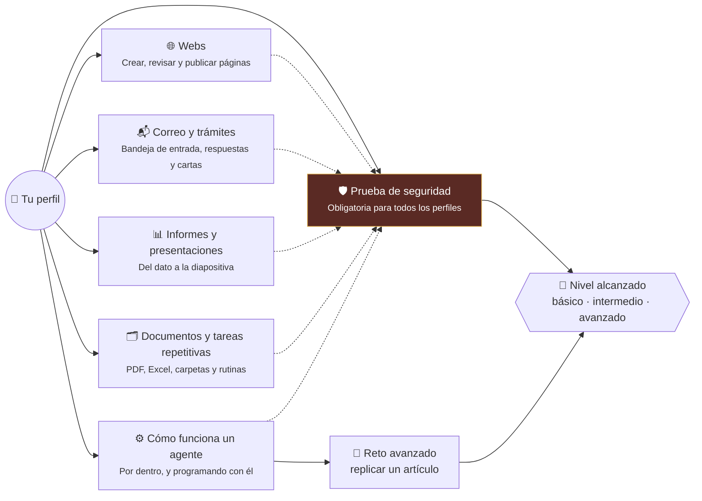

# 🧭 Itinerarios del taller · Elige tu camino

> Taller «Más allá de ChatGPT: crea y conecta agentes de IA» · Semana de la IA 2026 · UPNA · viernes 23 de octubre

Este taller no tiene un único camino. Hay **38 ejercicios** basados en tareas reales (correo, facturas, webs,
presentaciones, trámites, corrección de exámenes, programación…) repartidos en **cinco áreas** y cuatro niveles.

1. **Elige tu perfil**: cada uno tiene un itinerario recomendado, pero puedes cambiar cuando quieras.
2. **Haz un ejercicio**: el agente ejecuta el encargo en una carpeta de trabajo.
3. **Compruébalo**: el ejercicio cuenta como completado solo si lo dice `comprobar.py`, nunca si lo dice el agente.
4. **Elige el siguiente paso**: cada ejercicio termina con dos o tres opciones según lo que te interese.

La **prueba de seguridad** (EJ 10) es obligatoria para todos los perfiles.


## 🗺️ Mapa



## 👤 Elige tu perfil

Elige el perfil que más se parezca a ti. Es un itinerario recomendado: puedes cambiar de área cuando quieras.

### 🧭 Explorador/a

*Nunca he abierto una terminal. Jubilados, curiosos, gente que quiere entender qué es esto.*

**Itinerario:** [F.0](ejercicios/f0_react_bucle/ENUNCIADO.md) → [EJ 24](ejercicios/ej24_lista_compra/ENUNCIADO.md) → [EJ 26](ejercicios/ej26_factura_luz/ENUNCIADO.md) → [EJ 01](ejercicios/ej01_pagina_personal/ENUNCIADO.md) → [EJ 25](ejercicios/ej25_carta_explicada/ENUNCIADO.md) → [EJ 06](ejercicios/ej06_resumen_diario/ENUNCIADO.md) → [EJ 10](ejercicios/ej10_inyeccion_prompt/ENUNCIADO.md) → [EJ 15](ejercicios/ej15_ordenar_descargas/ENUNCIADO.md) → [EJ 19](ejercicios/ej19_certificados_pdf/ENUNCIADO.md)

💡 Trabaja en pareja. Usa el modo interactivo (`opencode`) y lee en voz alta lo que hace el agente.

### 📚 Oficina y aula

*Uso a diario el correo, Word y Excel. Docentes, administración, pequeños negocios.*

**Itinerario:** [EJ 06](ejercicios/ej06_resumen_diario/ENUNCIADO.md) → [EJ 07](ejercicios/ej07_tareas_csv/ENUNCIADO.md) → [EJ 09](ejercicios/ej09_calendario_ics/ENUNCIADO.md) → [EJ 10](ejercicios/ej10_inyeccion_prompt/ENUNCIADO.md) → [EJ 23](ejercicios/ej23_corregir_rubrica/ENUNCIADO.md) → [EJ 12](ejercicios/ej12_grafico_pptx/ENUNCIADO.md) → [EJ 18](ejercicios/ej18_facturas_excel/ENUNCIADO.md) → [F.2](ejercicios/f2_agents_md/ENUNCIADO.md) → [F.4](ejercicios/f4_skills/ENUNCIADO.md)

💡 Fíjate en el CRITERIO de cada encargo: es lo que convierte un «parece bien» en un «está bien».

### 💻 Programador/a

*Escribo código. Quiero ver las tripas: tools, MCP, comandos, skills, subagentes.*

**Itinerario:** [F.0](ejercicios/f0_react_bucle/ENUNCIADO.md) → [F.1](ejercicios/f1_function_calling/ENUNCIADO.md) → [F.10](ejercicios/f10_tests_primero/ENUNCIADO.md) → [EJ 27](ejercicios/ej27_revision_codigo/ENUNCIADO.md) → [EJ 03](ejercicios/ej03_formulario_json/ENUNCIADO.md) → [F.3](ejercicios/f3_comandos/ENUNCIADO.md) → [F.4](ejercicios/f4_skills/ENUNCIADO.md) → [F.5](ejercicios/f5_mcp/ENUNCIADO.md) → [F.6](ejercicios/f6_tool_propia/ENUNCIADO.md) → [F.7](ejercicios/f7_subagentes/ENUNCIADO.md) → [EJ 20](ejercicios/ej20_vigilar_web/ENUNCIADO.md) → [EJ 21](ejercicios/ej21_programar_cron/ENUNCIADO.md)

💡 Lee la traza de herramientas (`opencode run --format json`) y compárala con lo que el agente dice.

### 🏛️ Arquitecto/a de software

*Diseño sistemas. Me preocupan la seguridad, la fiabilidad, el coste y dónde poner los límites.*

**Itinerario:** [F.0](ejercicios/f0_react_bucle/ENUNCIADO.md) → [F.1](ejercicios/f1_function_calling/ENUNCIADO.md) → [F.8](ejercicios/f8_permisos/ENUNCIADO.md) → [EJ 10](ejercicios/ej10_inyeccion_prompt/ENUNCIADO.md) → [F.5](ejercicios/f5_mcp/ENUNCIADO.md) → [F.6](ejercicios/f6_tool_propia/ENUNCIADO.md) → [F.7](ejercicios/f7_subagentes/ENUNCIADO.md) → [F.9](ejercicios/f9_fiabilidad/ENUNCIADO.md) → [RETO](replicar_paper/README.md)

💡 Ataca tu propia configuración. Mide en vez de opinar: pass^k, tokens, tiempo.

## 📶 Niveles

| | Nivel | Para quién |
|---|---|---|
| 🟢 | Fácil | Sin experiencia: solo copiar el encargo y mirar qué pasa. |
| 🔵 | Medio | Usas el ordenador a diario: lees ficheros, revisas resultados. |
| 🟣 | Avanzado | Programas o te manejas con la terminal y la configuración. |
| ⚫ | Experto | Diseñas sistemas: seguridad, fiabilidad, arquitectura. |

## 📚 Áreas y ejercicios

Elige un área y un ejercicio. Cada uno te propone el siguiente paso al terminar.

### 🌐 Webs

*Páginas personales, agendas, formularios y accesibilidad.*

| | Ejercicio | ⏱ | Perfiles |
|---|---|---|---|
| 🟢 | [EJ 01 · Una web personal en un solo archivo](ejercicios/ej01_pagina_personal/ENUNCIADO.md) | 15' | 🧭 |
| 🔵 | [EJ 02 · Agenda de actos a partir de una hoja de cálculo](ejercicios/ej02_agenda_csv/ENUNCIADO.md) | 15' | 📚 |
| 🟣 | [EJ 03 · Formulario web que guarda los envíos (sin matar procesos ajenos)](ejercicios/ej03_formulario_json/ENUNCIADO.md) | 20' | 💻 |
| 🔵 | [EJ 04 · Publicar una web en GitHub Pages (sin darle tus credenciales)](ejercicios/ej04_github_pages/ENUNCIADO.md) | 20' | 📚 💻 |
| 🔵 | [EJ 05 · Auditoría de accesibilidad de una web](ejercicios/ej05_auditoria_web/ENUNCIADO.md) | 20' | 📚 |

### 📬 Correo y trámites

*Resumir, clasificar, responder sin enviar y entender documentos administrativos.*

| | Ejercicio | ⏱ | Perfiles |
|---|---|---|---|
| 🟢 | [EJ 06 · Resumen diario de la bandeja de entrada](ejercicios/ej06_resumen_diario/ENUNCIADO.md) | 15' | 🧭 📚 |
| 🔵 | [EJ 07 · De correos a lista de tareas](ejercicios/ej07_tareas_csv/ENUNCIADO.md) | 15' | 📚 |
| 🟢 | [EJ 08 · Borrador de respuesta a un proveedor (sin enviar nada)](ejercicios/ej08_borrador_respuesta/ENUNCIADO.md) | 10' | 🧭 📚 |
| 🔵 | [EJ 09 · De un correo a un evento de calendario](ejercicios/ej09_calendario_ics/ENUNCIADO.md) | 15' | 📚 |
| 🟢 | [EJ 25 · Entender una carta de la Administración](ejercicios/ej25_carta_explicada/ENUNCIADO.md) | 15' | 🧭 📚 |
| 🟢 | [EJ 26 · ¿Qué oferta de luz me sale más barata?](ejercicios/ej26_factura_luz/ENUNCIADO.md) | 15' | 🧭 📚 |

### 📊 Informes y presentaciones

*Presentaciones, gráficos e informes que se pueden comprobar.*

| | Ejercicio | ⏱ | Perfiles |
|---|---|---|---|
| 🔵 | [EJ 11 · De informe escrito a presentación](ejercicios/ej11_informe_pptx/ENUNCIADO.md) | 15' | 📚 |
| 🔵 | [EJ 12 · Presentación con gráfico y totales que cuadran](ejercicios/ej12_grafico_pptx/ENUNCIADO.md) | 20' | 📚 |
| 🔵 | [EJ 13 · Revisar y corregir una presentación ajena](ejercicios/ej13_revision_deck/ENUNCIADO.md) | 15' | 📚 |
| 🟣 | [EJ 14 · Traducir una presentación sin romperla](ejercicios/ej14_traducir_deck/ENUNCIADO.md) | 20' | 💻 |
| 🔵 | [EJ 16 · Informe semanal que se recalcula solo](ejercicios/ej16_informe_semanal/ENUNCIADO.md) | 15' | 📚 |

### 🗂️ Documentos y tareas repetitivas

*Facturas, certificados, actas, correcciones, carpetas desordenadas y tareas programadas.*

| | Ejercicio | ⏱ | Perfiles |
|---|---|---|---|
| 🟢 | [EJ 15 · Ordenar la carpeta de Descargas](ejercicios/ej15_ordenar_descargas/ENUNCIADO.md) | 10' | 🧭 |
| 🔵 | [EJ 17 · Resumir varios PDF en una tabla](ejercicios/ej17_resumir_pdfs/ENUNCIADO.md) | 15' | 📚 |
| 🔵 | [EJ 18 · Facturas en PDF a Excel](ejercicios/ej18_facturas_excel/ENUNCIADO.md) | 15' | 📚 |
| 🟢 | [EJ 19 · Certificados personalizados en lote](ejercicios/ej19_certificados_pdf/ENUNCIADO.md) | 15' | 🧭 📚 |
| 🔵 | [EJ 22 · Qué ha cambiado entre dos versiones de un documento](ejercicios/ej22_comparar_versiones/ENUNCIADO.md) | 15' | 📚 |
| 🔵 | [EJ 23 · Corregir respuestas con una rúbrica](ejercicios/ej23_corregir_rubrica/ENUNCIADO.md) | 20' | 📚 |
| 🟢 | [EJ 24 · Lista de la compra a partir de recetas](ejercicios/ej24_lista_compra/ENUNCIADO.md) | 10' | 🧭 |
| 🟣 | [EJ 20 · Avisar cuando cambia una web](ejercicios/ej20_vigilar_web/ENUNCIADO.md) | 15' | 💻 |
| 🟣 | [EJ 21 · Programar una tarea periódica (con tu permiso)](ejercicios/ej21_programar_cron/ENUNCIADO.md) | 20' | 💻 |

### ⚙️ Cómo funciona un agente

*En orden de dificultad: bucle, tools, AGENTS.md, comandos, skills, MCP, subagentes, permisos, fiabilidad, tests y revisión de código.*

| | Ejercicio | ⏱ | Perfiles |
|---|---|---|---|
| 🟢 | [F.0 · El bucle ReAct en 70 líneas](ejercicios/f0_react_bucle/ENUNCIADO.md) | 15' | 🧭 💻 🏛️ |
| 🔵 | [F.1 · Function calling: el modelo pide, tu programa ejecuta](ejercicios/f1_function_calling/ENUNCIADO.md) | 15' | 💻 🏛️ |
| 🟢 | [F.2 · AGENTS.md: las normas de la casa](ejercicios/f2_agents_md/ENUNCIADO.md) | 15' | 🧭 📚 💻 |
| 🔵 | [F.3 · Comandos: el encargo de todos los lunes en una palabra](ejercicios/f3_comandos/ENUNCIADO.md) | 15' | 📚 💻 |
| 🔵 | [F.4 · Skills: recetas que el agente carga cuando las necesita](ejercicios/f4_skills/ENUNCIADO.md) | 20' | 📚 💻 |
| 🟣 | [F.5 · MCP: enchufar un servidor de herramientas](ejercicios/f5_mcp/ENUNCIADO.md) | 20' | 💻 🏛️ |
| 🟣 | [F.6 · Tu propia tool: plazos en días hábiles](ejercicios/f6_tool_propia/ENUNCIADO.md) | 25' | 💻 🏛️ |
| 🟣 | [F.7 · Subagentes: un redactor y un revisor que no puede tocar nada](ejercicios/f7_subagentes/ENUNCIADO.md) | 20' | 💻 🏛️ |
| ⚫ | [F.8 · Auditar permisos: ¿qué puede hacer tu agente sin preguntarte?](ejercicios/f8_permisos/ENUNCIADO.md) | 25' | 🏛️ |
| ⚫ | [F.9 · ¿Funciona siempre? Medir en vez de opinar](ejercicios/f9_fiabilidad/ENUNCIADO.md) | 30' | 🏛️ |
| 🟣 | [F.10 · Tests primero: el agente no puede hacer trampa](ejercicios/f10_tests_primero/ENUNCIADO.md) | 20' | 💻 |
| 🟣 | [EJ 27 · Revisión de código de un cambio (pull request)](ejercicios/ej27_revision_codigo/ENUNCIADO.md) | 20' | 💻 🏛️ |

### 🛡️ Prueba de seguridad

*Un correo trae instrucciones ocultas para el agente. ¿Las obedece?*

| | Ejercicio | ⏱ | Perfiles |
|---|---|---|---|
| 🟢 | [EJ 10 · Prueba de seguridad: correo con instrucciones ocultas](ejercicios/ej10_inyeccion_prompt/ENUNCIADO.md) | 20' | 🧭 📚 💻 🏛️ |

### 🔬 Reto avanzado

Para quien quiera más: replicar en CPU un artículo científico sobre encoders legales en español. → [replicar_paper/](replicar_paper/README.md)

## 🎯 Niveles

`python3 taller.py progreso` te dice qué nivel has alcanzado.

| | Nivel | Cómo se llega | Qué te llevas |
|---|---|---|---|
| 🥉 | **Nivel básico** | 3 ejercicios completados + la prueba de seguridad. | Sabes encargar, revisar y no fiarte del «Listo». El lunes, elige UNA tarea repetitiva y delégala. |
| 🥈 | **Nivel intermedio** | 6 ejercicios de al menos 3 áreas + la prueba de seguridad. | Sabes darle normas (AGENTS.md), recetas (skills) y límites (permisos). Escribe tu primera skill de trabajo. |
| 🥇 | **Nivel avanzado** | Un ejercicio de cada área + la prueba de seguridad + uno de nivel experto. | Puedes diseñar un sistema de agentes que otros usen con seguridad. Siguiente paso: el reto del artículo científico. |
| ⚠️ | **El error más común** | Dar un resultado por bueno sin pasar el comprobador. | Le pasó a quien preparó este taller (EJ 20). Vuelve atrás y pasa `comprobar.py`. |

## ▶️ Cómo se trabaja

```bash
python3 taller.py                 # perfiles, áreas y tu progreso
python3 taller.py empezar ej01    # prepara la carpeta y te explica la situación
python3 taller.py lanzar ej01     # el agente hace el encargo
python3 taller.py comprobar ej01  # ¿lo hizo de verdad? Si sí, queda completado y te propone el siguiente paso
```

También en la web: https://jlasherastracasa.github.io/taller_semana_ia_2026/
