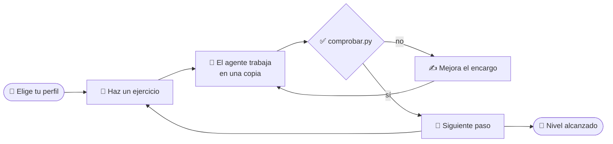

# 🧭 Cómo funciona el taller

No hay un único camino. Cada persona elige su itinerario según su perfil y va eligiendo el siguiente ejercicio.

1. **Elige tu perfil** (`python3 taller.py` o la web): 🧭 Explorador/a, 📚 Oficina y aula, 💻 Programador/a,
   🏛️ Arquitecto/a. Cada uno tiene un itinerario recomendado; puedes salirte cuando quieras.
2. **Haz el ejercicio**: `python3 taller.py empezar ej01` → `lanzar ej01` → `comprobar ej01`.
3. **Compruébalo**: cuenta como completado solo si lo dice `comprobar.py`. Si el agente dice «Listo» y el comprobador
   dice ❌, manda el comprobador.
4. **Elige el siguiente paso**: cada ejercicio termina con dos o tres opciones.
5. **Haz la prueba de seguridad** (EJ 10): es obligatoria para todos los perfiles.
6. **Mira tu nivel**: `python3 taller.py progreso` o «Mi progreso» en la web.

## Áreas

| | Área | De qué va |
|---|---|---|
| 🌐 | Webs | Páginas personales, agendas, formularios, accesibilidad, publicar |
| 📬 | Correo y trámites | Resumir y clasificar correos, responder sin enviar, calendario, cartas y facturas de casa |
| 📊 | Informes y presentaciones | Presentaciones, gráficos e informes que se pueden comprobar |
| 🗂️ | Documentos y tareas repetitivas | PDF, Excel, certificados, actas, corrección de exámenes, tareas programadas |
| ⚙️ | Cómo funciona un agente | Bucle, tools, AGENTS.md, comandos, skills, MCP, subagentes, permisos, fiabilidad, tests, revisión de código |
| 🛡️ | Prueba de seguridad | Un correo con instrucciones ocultas para el agente |

## Niveles de dificultad

| | Nivel | Para quién |
|---|---|---|
| 🟢 | Fácil | Sin experiencia: copiar el encargo y mirar qué pasa |
| 🔵 | Medio | Usas el ordenador a diario: lees ficheros, revisas resultados |
| 🟣 | Avanzado | Programas o te manejas con la terminal y la configuración |
| ⚫ | Experto | Diseñas sistemas: seguridad, fiabilidad, arquitectura |

## Nivel alcanzado

| | Nivel | Cómo se llega |
|---|---|---|
| 🥉 | Básico | 3 ejercicios + la prueba de seguridad |
| 🥈 | Intermedio | 6 ejercicios de al menos 3 áreas + la prueba de seguridad |
| 🥇 | Avanzado | Un ejercicio de cada área + la prueba de seguridad + uno de nivel experto |
| ⚠️ | El error más común | Dar algo por bueno sin pasar el comprobador |

## Trucos

- **Mejora el encargo**: `python3 taller.py lanzar ej07 --prompt "tu versión"`. ¿Pasa ahora el comprobador?
- `python3 taller.py abrir ej21` abre opencode en **modo interactivo** para conversar y aprobar permisos.
- Si te atascas, compara con `alumnos/soluciones/<ejercicio>/`: está la salida real del agente cuando lo validamos.
