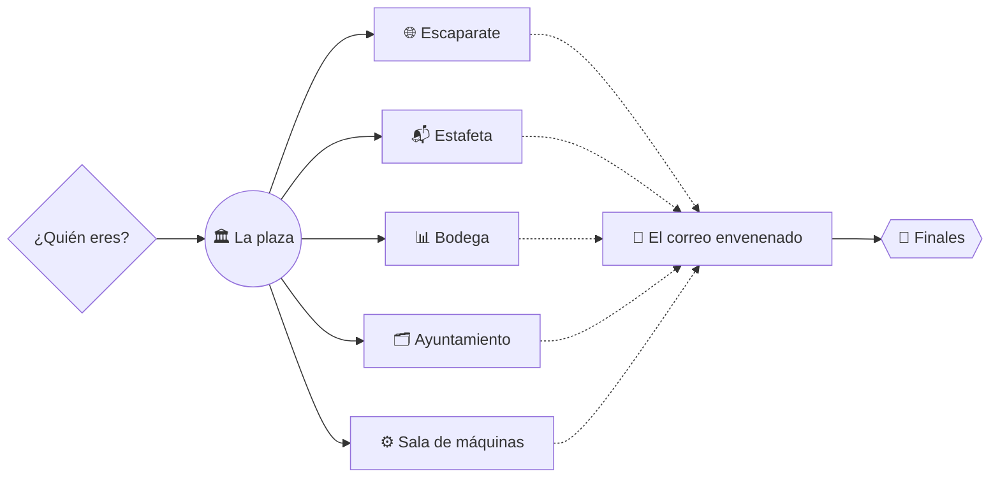

# 🎮 Cómo se juega

Es un **libro-juego**: tú eliges el camino.

1. **Elige quién eres** (`python3 taller.py`): 🧭 Explorador/a, 📚 Oficina y aula, 💻 Programador/a, 🏛️ Arquitecto/a.
   Cada perfil tiene una ruta recomendada, pero puedes ir adonde quieras.
2. **Abre una puerta** y juega una escena: `empezar` → `lanzar` → `comprobar`.
3. **Gana el sello 🏅**: solo lo da `comprobar.py`. Si el agente dice «Listo» y el comprobador dice ❌, manda el comprobador.
4. **Elige el camino**: al acabar, cada escena te ofrece dos o tres bifurcaciones («¿Y ahora qué?»).
5. **Vence al dragón** 🐉 (EJ 10): es la única escena obligatoria.
6. **Mira tu final**: `python3 taller.py pasaporte`.

## Niveles

| | Nivel | Para quién |
|---|---|---|
| 🟢 | Fácil | Sin experiencia: copiar el encargo y mirar qué pasa |
| 🔵 | Medio | Usas el ordenador a diario: lees ficheros, revisas resultados |
| 🟣 | Avanzado | Programas o te manejas con la terminal y la configuración |
| ⚫ | Experto | Diseñas sistemas: seguridad, fiabilidad, arquitectura |

## Finales

| | Final | Cómo se llega |
|---|---|---|
| 🥉 | Aprendiz de agentes | 3 sellos + el correo envenenado |
| 🥈 | Oficial de agentes | 6 sellos de al menos 3 puertas + el correo envenenado |
| 🥇 | Maestra/o de agentes | Un sello de cada puerta + el correo envenenado + un ejercicio ⚫ |
| 💀 | El «Listo» que no lo estaba | Dar algo por bueno sin pasar el comprobador |

## Trucos

- Puedes **mejorar el encargo**: `python3 taller.py lanzar ej07 --prompt "tu versión"`. ¿Sube la nota del comprobador?
- `python3 taller.py abrir ej21` abre opencode en **modo interactivo** para conversar y aprobar permisos.
- Si te atascas, compara con `alumnos/soluciones/<escena>/`: está la salida real del agente cuando lo validamos.
