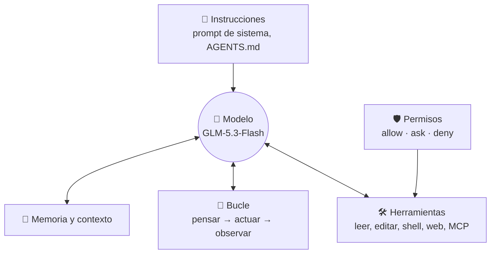
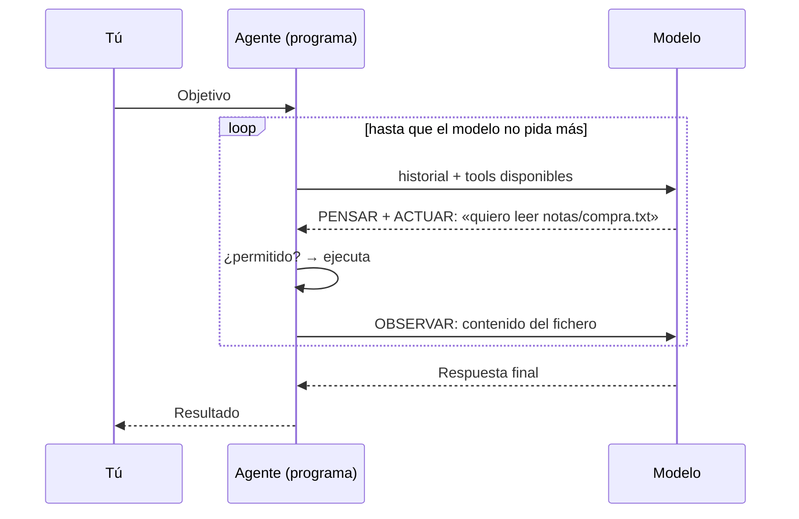

# 🧠 Conceptos

Todo lo que necesitas para entender qué hace (y qué hace mal) un agente. Cada concepto tiene su escena en la
**sala de máquinas** ⚙️ para verlo funcionar.

## Chat, chat con herramientas y agente

| | Qué hace | Ejemplo |
|---|---|---|
| **Chatbot** | Recibe texto y devuelve texto. No toca nada. | «Resume este correo» |
| **Chat con herramientas** | Puede pedir una acción concreta; tú decides cada paso. | «Busca el tiempo en Pamplona» |
| **Agente** | Recibe un **objetivo**, decide los pasos, usa herramientas en bucle y comprueba el resultado. | «Ordena mis descargas y hazme un informe» |

## Anatomía de un agente

El modelo **solo produce texto**. Todo lo que «hace» lo ejecuta el programa (opencode) a través de herramientas, y
los permisos deciden qué puede hacer sin preguntarte.

## ReAct: pensar, actuar, observar (escena F.0)

Dos lecciones de la validación: el bucle termina cuando **el modelo decide**, no cuando está bien hecho; y el
historial que le devuelves **es su memoria**: guardado mal, el agente dejaba de responder a la pregunta.

## Tools y function calling (escena F.1)

Una *tool* es una función descrita con un esquema JSON (nombre, descripción, parámetros). El modelo responde con algo
como `{"name": "calculadora", "arguments": {"expresion": "(1250+3750)*1.21"}}` y **tu programa decide** si la
ejecuta. Los argumentos los escribe el modelo… o un atacante a través de un documento que el modelo ha leído.

## Las piezas de opencode 2.x

| Pieza | Qué es | Dónde vive | Cuándo se usa | Escena |
|---|---|---|---|---|
| **AGENTS.md** | Normas permanentes del proyecto | `AGENTS.md` | Siempre | F.2 |
| **Comando** | Un encargo guardado con nombre | `.opencode/commands/x.md` | Cuando escribes `/x` (modo interactivo) | F.3 |
| **Skill** | Receta con instrucciones y scripts | `.opencode/skills/x/SKILL.md` | Cuando el agente la necesita (por su descripción) | F.4 |
| **MCP** | Servidor que ofrece tools | `opencode.json` → `mcp` | El agente las busca en un catálogo | F.5 · F.6 |
| **Subagente** | Otro agente con sus propios permisos | `.opencode/agents/x.md` | Cuando el principal delega | F.7 |
| **Permisos** | `allow` · `ask` · `deny` por herramienta | `opencode.json` → `permission` | Antes de cada acción | F.8 |

> Regla mnemotécnica: **AGENTS.md manda, el comando se invoca, la skill se aprende, MCP enchufa, el subagente
> colabora y el permiso frena.**

### MCP en opencode 2.x

Las tools de un servidor MCP no aparecen sueltas: el modelo las **busca en un catálogo** (`search`) y las invoca
**escribiendo un poco de código** con la tool `execute` (`tools.plazos.dias_habiles({...})`). El catálogo se carga
unos segundos después de arrancar.

## Fiabilidad: pass@k y pass^k (escena F.9)

- **pass@k**: probabilidad de que salga bien **alguna** de k veces.
- **pass^k**: probabilidad de que salga bien **las k** veces. Es lo que importa en una rutina.

Con un 80 % de acierto por intento, cinco seguidos bien es 0,8⁵ ≈ **33 %**. En la validación, el EJ 07 salió 3 de 4.
