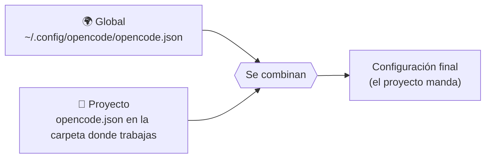

# ⚙️ El fichero `opencode.json`: qué es, dónde va y cómo se escribe

`opencode.json` es la **configuración del agente**: qué modelo usa, con qué proveedor, qué puede hacer sin
preguntarte (permisos) y qué servidores de herramientas (MCP) tiene enchufados. Es un JSON normal: llaves, comillas
dobles y comas entre elementos (sin coma después del último).

## 📍 Dónde se pone



| Dónde | Ruta | Para qué |
|---|---|---|
| **Proyecto** (la que usamos) | `opencode.json` en la carpeta desde la que lanzas `opencode` | La configuración de ESE trabajo. `taller.py` la copia en cada carpeta de escena. |
| **Global** | Linux/macOS: `~/.config/opencode/opencode.json` · Windows: `%USERPROFILE%\.config\opencode\opencode.json` | Lo que quieres en todos tus proyectos. **Cuidado**: también se carga en el taller. |

Las dos se **combinan** y, si chocan, gana la del proyecto. Lo que pongas en la global (por ejemplo, un MCP con 30
tools) aparecerá también en el taller: así nació el «Listo» falso del EJ 20.

> 🔍 ¿Qué ficheros está leyendo? `opencode debug config` lista cada fuente y su contenido (las claves salen como
> `***`). Ojo: se lo pregunta al **servicio en segundo plano** de opencode 2, que arrancó con la carpeta y las
> variables de su momento. Si has cambiado algo, `opencode service restart` y vuelve a mirar.

## 🧩 Un `opencode.json` completo, explicado

Es el del kit (`alumnos/opencode.json`), con comentarios. **Ojo:** JSON no admite comentarios; si los quieres,
llama al fichero `opencode.jsonc`.

```jsonc
{
  // Ayuda al editor a autocompletar y avisarte de errores
  "$schema": "https://opencode.ai/config.json",

  // Modelo por defecto: "<proveedor>/<modelo>"
  "model": "vllm/Qwen3.8-27B-FP8",

  "provider": {
    "vllm": {                                   // el nombre que tú le das al proveedor
      "npm": "@ai-sdk/openai-compatible",       // cualquier API compatible con la de OpenAI (LiteLLM, vLLM…)
      "name": "LiteLLM del taller",
      "options": {
        "baseURL": "{env:LITELLM_API_BASE}/v1", // {env:X} = valor de la variable de entorno X
        "apiKey": "{env:LITELLM_API_KEY}"       // ¡NUNCA la clave escrita aquí!
      },
      "models": {
        "Qwen3.8-27B-FP8": {                    // el id que espera el servidor
          "name": "GLM-5.3-Flash (se publica como Qwen3.8-27B-FP8 por compatibilidad)",
          "limit": { "context": 262144, "output": 32768 }
        }
      }
    }
  },

  "permission": {
    "edit": "allow",                 // crear y modificar ficheros sin preguntar
    "webfetch": "allow",             // descargar páginas web
    "external_directory": "deny",    // nada fuera de la carpeta de trabajo
    "question": "deny",              // que no te pregunte: en «opencode run» nadie contesta
    "doom_loop": "deny",             // cortar bucles que se repiten
    "bash": {                        // órdenes de terminal, por patrones
      "*": "allow",                  //   todo permitido…
      "rm -rf *": "deny",            //   …salvo lo irreversible
      "rm -r *": "deny",
      "sudo *": "deny",
      "kill *": "deny", "pkill *": "deny", "killall *": "deny",
      "*| sh*": "deny", "*| bash*": "deny",   // «curl … | sh»
      "chmod -R *": "deny",
      "git push *": "ask",           //   y que pregunte lo que sale de tu máquina
      "crontab *": "ask",
      "systemctl *": "ask"
    }
  }
}
```

### Las tres reglas de los permisos

1. **`allow`** = lo hace · **`ask`** = te pregunta · **`deny`** = prohibido.
2. En los patrones, `*` es «cualquier cosa» (también nada) y `?` «un carácter».
3. **Gana la ÚLTIMA regla que coincide.** Por eso `"*": "allow"` va **primero**: si lo pones al final, anula todos
   los `deny`. Pruébalo en la escena F.8 con `simular_permisos.py`.

## 🔁 Variantes que vas a necesitar

### Usar OpenRouter en vez de LiteLLM

OpenRouter viene de serie en opencode; basta con la variable `OPENROUTER_API_KEY` en tu `.env` y cambiar el modelo:

```json
{ "model": "openrouter/z-ai/glm-5.3-flash" }
```

(`taller.py` lo hace solo si en tu `.env` solo hay clave de OpenRouter.)

### Enchufar un servidor MCP (escenas F.5 y F.6)

```json
{
  "mcp": {
    "plazos": {
      "type": "local",
      "command": ["python3", "dias_habiles_mcp.py"],
      "enabled": true
    }
  }
}
```

`python3` tiene que ser el de tu `.venv` (el que tiene el paquete `mcp`): activa el entorno antes de lanzar opencode.

### Más permisivo para trabajar tú delante (modo interactivo)

```json
{ "permission": { "bash": "ask", "edit": "ask" } }
```

Te preguntará cada orden y cada cambio. Es lo recomendable con **ficheros de verdad**.

## 🧯 Errores típicos

| Síntoma | Causa |
|---|---|
| `Invalid URL` | `{env:LITELLM_API_BASE}` vacía: el `.env` no está cargado (usa `--standalone` o `taller.py`; ver [Variables de entorno](Variables-de-entorno.md)) |
| `No api key passed in` | Igual, con `LITELLM_API_KEY` |
| El modelo no existe | El id de `models` no coincide con el del servidor, o falta el prefijo `proveedor/` en `model` |
| Ignora tu configuración | Estás lanzando desde otra carpeta: opencode busca `opencode.json` donde trabaja (`PWD`) |
| JSON inválido | Una coma de más al final, comillas simples o comentarios en un `.json` (usa `.jsonc`) |
| Aparecen tools o skills que no has puesto | Vienen de tu configuración **global** (`~/.config/opencode/`) o de skills globales (`~/.claude/skills`, `~/.agents/skills`) |

## ✅ Antes de usarlo con ficheros de verdad

- [ ] Ninguna clave escrita: solo `{env:…}`.
- [ ] `"*": "allow"` (si lo usas) **antes** de los `deny`.
- [ ] `external_directory` en `deny` o `ask`.
- [ ] Lo irreversible en `deny`, lo que sale de tu máquina en `ask`.
- [ ] Revisado con `opencode debug config` (tras `opencode service restart`).
